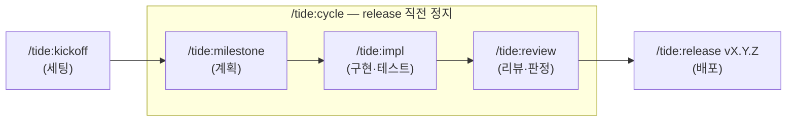

# tide

**마일스톤 → 구현 → 리뷰 → 릴리즈** 개발 사이클을 프로젝트 독립적인 **Claude Code
슬래시 커맨드**로 구현한 워크플로우 모음입니다. 어떤 저장소에든 얹어 동일한 개발
리듬과 문서화 규율을 그대로 적용할 수 있습니다.

`/tide:cycle`은 `milestone → impl → review`를 한 번에 이어 실행하고, git 작업을 하는
`release`만은 자동 체이닝에서 빼고 직전에 멈춰 안내합니다. `/tide:status`로는 언제든
현재 위치와 다음 커맨드를 읽기 전용으로 확인할 수 있습니다.

## 핵심 가치

- **부수효과 분리** — `impl`·`review`는 절대 git 작업을 하지 않고(코드·보고서만 남김),
  git commit/tag/push는 오직 `release`에서만 일어납니다. 의도치 않은 커밋이 사이클
  중간에 끼어들지 않습니다.
- **hook으로 기계적 강제** — 프롬프트 지시뿐 아니라 **tide-guard hook**이 `.tide/phase`
  상태를 보고 `release`가 아닌 동안 git commit/tag/push를 차단합니다.
- **프로젝트 독립성** — 특정 언어·스택에 묶이지 않습니다. 버전 파일도 `Cargo.toml`·
  `package.json`·`pyproject.toml` 등 스택에 맞춰 다룹니다.
- **문서화 규율** — 마일스톤·완료보고서·리뷰보고서·회고가 정해진 형식으로 남아,
  사이클이 쌓일수록 의사결정 이력이 추적됩니다.

## 시작하기

설치와 첫 사이클은 **[시작하기](getting-started.md)** 에서 5분 만에 따라 할 수 있습니다.
각 커맨드의 정확한 인자·산출물은 **[커맨드 레퍼런스](commands.md)**, 사이클을 떠받치는
설계 원칙은 **[개념](concepts.md)**, 형식·규칙의 세부는 **[규약](conventions.md)** 에 있습니다.
